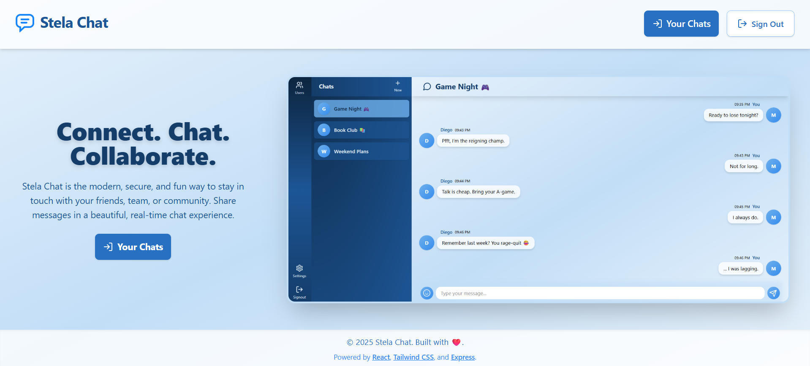
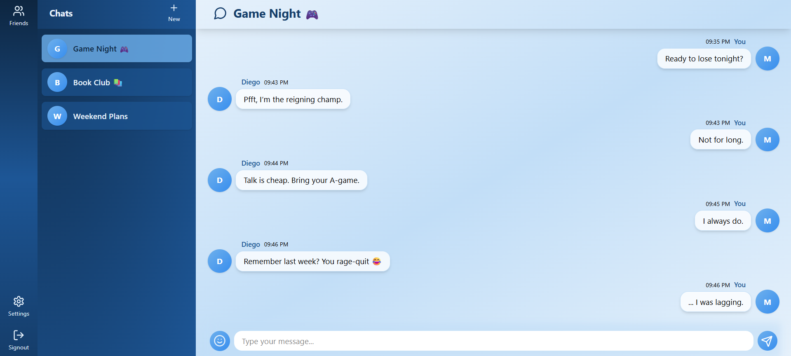

# Stela Chat 💬

A modern, full-featured messaging app built as part of [The Odin Project](https://www.theodinproject.com/) web development curriculum. Stela Chat is designed with a focus on real-time communication, beautiful UI, and robust security, following the [JAMstack](https://jamstack.org/) architecture.

## ✨ Features
- Real-time chat with multiple users and channels
- Guest sign-in for instant temporary access
- User authentication and registration
- Friend requests and user management
- Responsive, mobile-friendly design, with a modern UI
- Error handling and loading states

## 🌐 Deployment
Try out the web app with the following link: [Stela Chat](https://example.com/)

## 🏗️ Tech Stack (JAMstack)
- **J**avaScript/TypeScript (React, Node.js)
- **A**PIs (RESTful Express API, Prisma ORM)
- **M**arkup (React SPA, HTML, Tailwind CSS)

### Frontend
- ⚛️ **React** (with Vite for fast development)
- 🎨 **Tailwind CSS** (utility-first styling)
- 🦄 **Lucide-react** (icon library)
- 🔗 **React Router** (SPA routing)
- 🔥 **React Query** (data fetching and caching)
- 🧩 Custom components and hooks (Avatar, Modals, Chat UI, etc.)

### Backend
- 🏃 **Express.js** (REST API server)
- 🗄️ **Prisma** (ORM for PostgreSQL)
- 🔒 **bcrypt** (password hashing)
- 🛡️ **CORS** (secure cross-origin requests)
- 🧑‍💻 **Jest** (testing)
- ⚡ **Socket.io** (real-time communication)

## 📸 Screenshots

Here are some screenshots of the application:

*Home Page*



*Chat Page*



## 📦 Installation & Setup

### Prerequisites
- Node.js (v18+ recommended)
- npm or yarn
- PostgreSQL database (local or cloud)

### 1. Clone the repository
```bash
git clone https://github.com/Hi-kue/stela-chat.git
cd stela-chat
```

### 2. Install dependencies
```bash
cd server && npm install
cd ../client && npm install
```

### 3. Configure environment variables
- Copy `.env.example` to `.env` in the `server/` and `client/` directory and fill in the needed values.

### 4. Set up the database
```bash
cd server
npx prisma migrate dev --name init
npx prisma generate
```

### 5. Start the backend server
```bash
npm run dev
```

### 6. Start the frontend
```bash
cd ../client
npm run dev
```

- The frontend will be available at `http://localhost:5173` (or as shown in your terminal)
- The backend API will run at `http://localhost:3000` (or as configured)

## 🤝 Credits
- Built for [The Odin Project](https://www.theodinproject.com/)
- Inspired by Discord, Slack, and other modern chat apps

## 📚 License
MIT
